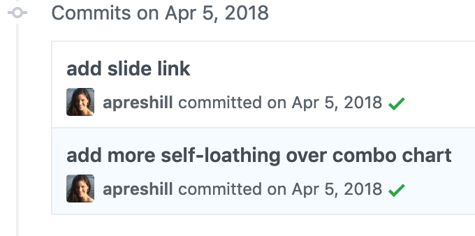

# Sad Plot Showcase

Plots come in all shapes and sizes. But plots can also spark joy or sadness for you as the creator. There are so many reasons your plot might be sad...

:hourglass_flowing_sand: Did you run out of time so you just called good enough done? 

:heartpulse: Did you run out of the ~~will to live~~ patience to keep persevering through all the errors to make the plot you *really* *really* wanted to make?

:mag_right: Do you feel like you are proud of your plot but scared to share the code you used to make it? (i.e., a [total Monet](https://www.urbandictionary.com/define.php?term=Total%20Monet))

:hammer: Did you beat this plot into submission through a series of copy/paste Stack Overflow answers that *work*, but you don't know *why*?

:rabbit: Did you get pretty far down the rabbit hole of making your dream plot, only to find out that you didn't have the data you needed to make the plot you wanted?

:books: Did you hit a wall with your plotting skills, like you knew there must be a way in `ggplot2` to get there but you couldn't get your skill level up?

# Why Share Your Sad Plot

I originally did a talk about [my own sad plot](https://apreshill.github.io/ohsu-biodatavis/slides.html#1) last year, here is a representative [commit](https://github.com/apreshill/ohsu-biodatavis/commit/7a0e1b80248b30d1b5fc62ecf6c0cb2d839ecbdb):

I have more than my fair share of sad plots :sob:. For teaching and more talks over the next few months, I'm looking for other people to share their sad plots with me. I want to hear and see your sad plot stories.

I will **NOT** be publicly shaming anyone- the intent here is to normalize for beginners that:

1. we all have sad plots in our past (and present), and 

1. that we also move on with our lives. 

Depending on how many plots we see, I may try to build a showcase website so we can all revel in celebrating the plots of our past- the good plots that got away.

# How to Submit

You can do it through posting an issue or a creating a pull request in this repo, with a line saying "I give Alison Hill permission to use this in presentations that may be part of her work at RStudio." You can submit just a plot (`.png` works), or you could link to the code too if you want and it's easily shareable. Give them their own folder within [`the-sad-plot-file`](https://github.com/apreshill/sad-plot-showcase/tree/master/the-sad-plot-file). You can also tweet your sad plot at me [@apreshill](https://twitter.com/apreshill).

# Credit

:squirrel: I'm happy to give credit to you for your plot, or keep you anonymous if you'd rather not take credit ;)
